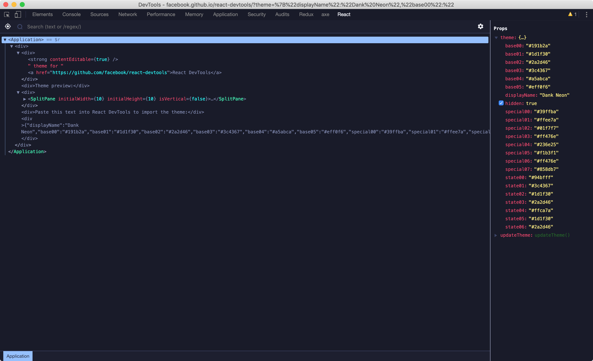

# Dank Neon for [React DevTools](https://github.com/facebook/react-devtools)

> A danker, more neon theme for [React DevTools](https://github.com/facebook/react-devtools).

## Install

### Install as a Custom Theme

[](http://facebook.github.io/react-devtools/?theme=%7B%22displayName%22:%22Dank%20Neon%22,%22base00%22:%22#191b2a%22,%22base01%22:%22#1d1f30%22,%22base02%22:%22#2a2d46%22,%22base03%22:%22#3c4367%22,%22base04%22:%22#a5abca%22,%22base05%22:%22#eff0f6%22,%22special00%22:%22#39ffba%22,%22special01%22:%22#ffee7a%22,%22special02%22:%22#01f7f7%22,%22special03%22:%22#ff476e%22,%22special04%22:%22#236e25%22,%22special05%22:%22#f1b3f1%22,%22special06%22:%22#ff476e%22,%22special07%22:%22#858db7%22,%22state00%22:%22#94bfff%22,%22state01%22:%22#3c4367%22,%22state02%22:%22#1d1f30%22,%22state03%22:%22#2a2d46%22,%22state04%22:%22#ffca7a%22,%22state05%22:%22#1d1f30%22,%22state06%22:%22#2a2d46%22%7D)

## Team

This theme is maintained by the following people

|  |  |
| ------------------------------------------------------------------------------------------------------------------- | ----------------------------------------------------------------------------------------------------- |
| [Jacobi Petrucciani](https://github.com/jpetrucciani)                                                               | [Conlin Durbin](https://github.com/wuz)                                                               |

## License

[MIT License](./LICENSE)
